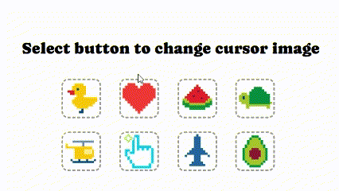

# mouse images 🖱️

[🔗 github page 바로가기 ](https://badahertz52.github.io/30projects_mouse-image)

### Index

#### <a href="#introduce">1.Project introduce</a>

#### <a href="#tech">2. Tech Skill</a>

#### <a href="#script">3. Script</a>

#### <a href="#study">4. Study</a>

- <a href="#ts">1) 템플릿 리터럴 타입</a>

- <a href="#throttling">2) Throttling</a>

---

### <div id="introduce">1. Project introduce</div>


<div height="32px">&nbsp;</div>
mouse image는 이미지 버튼을 클릭 하면 마우스 커서를 해당 이미지로 변경된 것 같은 기능을 제공한다.  
 실제로 마우스 커서의 이미지가 변경되지는 않고, 마우스 커서를 숨기고 선택된 이미지가 마우스의 움직임에 따라 다니게 되어 유저는 마치 마우스 커서가 바뀐 것 같은 경험을 하게 된다.

### <div id="tech">2. Tech Skill</div>

- HTML, CSS(SASS/SCSS)
- JS, Typescript
- React

## <div id="script">3. Script</div>

### Install

```bash
 yarn install
```

### Server Start

```bash
 yarn run start
```

### Build

```bash
  yarn run build
```

### <div id="study">4. Study</div>

### <div id="ts">1) 템플릿 리터럴 타입</div>

- <div id="type-code1">코드1</div>

```ts
type CursorType =
  | "cursor1"
  | "cursor2"
  | "cursor3"
  | "cursor4"
  | "cursor5"
  | "cursor6"
  | "cursor7"
  | "cursor8";
```

위의 CursorType은 커서 이미지 파일의 이름에 대한 타입으로, 버튼에서 선택된 이미지 파일을 커서 이미지 파일로 넘겨주는 데 사용된다.
위의 코드처럼 cursor1, cursor2,... 이렇게 적어도 되지만 이는 이미지 파일들이 더 많아질 경우 비효율적이고 유지보수측면에서도 좋지 않을 것 같아서 보다 간편하게 CursorType을 만드는 방법이 없을까 찾아봤다.

#### 문자열 리터럴 타입

타입스크립트는 문자열을 타입으로 사용할 수 있게 해주는 데 이를 문자열 리터럴 타입이라고 한다.

- <div id="type-code2"> 코드2</div>

  ```ts
  type Cursor = "cursor";
  let c1: Cursor = "cursor";
  ```

#### 템플릿 리터럴 타입

타입스크립트에서는 문자열 리터럴 타입을 조합해서 새로운 타입을 만들 수 있는 템플릿 리터럴 타입이 있다.

- <div id="type-code3"> 코드3</div>

  ```ts
  type File = 1 | 2 | 3 | 4 | 5 | 6 | 7 | 8 | 9 | 10;
  type CursorType = `cursor${Number}`;
  // “a1”|“a2”|“a3” … |“a10”
  ```

문자열 리커럴 타입과 템플릿 리터럴 타입을 활용하면 <a href="#type-code1"> 코드1</a>보다 <a href="#type-code3"> 코드3</a> 가 유지보수적인 측면에서 좋은 것 같다.

아쉬운 점이 있다면, 인수로 타입을 만들 수 있으면 좋을 것 같다. 아래의 코드처럼 인수에 따라 다른 타입을 반환할 수 있지만, a1 이거나 a2인 타입을 만드는 방법을 찾지는 못했다.

```ts
type TypeA<N extends number> = `${"a"}${N}`;

function createTypeA<N extends number>(n: N): TypeA<N> {
  return `a${n}` as TypeA<N>;
};

type A1 = createTypeA(1); // type :  "a1";
```

### <div id="throttling">2) Throttling</div>

마우스의 움직임에 따라 커서 이미지의 위치를 조정해야하는데, 마우스가 아주 조금 움직여도 커서 이미지의 위치가 바뀌기 때문에 짧은 시간에도 많은 이벤트가 발생한다는 문제가 있다.
이를 해결하기 위해서 쓰롤링을 이용하기로 했다.

```ts
const timer = useRef<undefined | NodeJS.Timeout>();
//....
const handleMouseMove = useCallback((event: MouseEvent) => {
  const mouseEvent = event;
  if (!timer.current) {
    timer.current = setTimeout(() => {
      timer.current = undefined;
      changeCursorPosition(mouseEvent);
    }, 50);
  }
}, []);
```

마우스 움직임이 무겁지 않는 최대한의 시간이 50밀리초라, 쓰롤링을 해도 크게 도움이 되지 않될지 모르지만 그래도 하지 않는 것보다는 나을 것 같았다.

handleMouseMove는 useCallback으로 감싸주고 있기 때문에, timer는 useRef를 사용했다.
